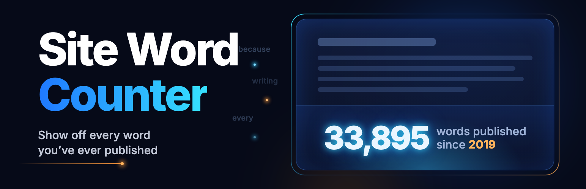

# Site Word Counter

Site Word Counter is a WordPress block that shows the total number of words published across a site.

By itself it's just a number, styled with the block editor's own typography, color, and spacing controls. Put it in a Row between two Paragraph blocks and it reads like a sentence: "Blogging 33,895 words since 2022." The idea started in [this post](https://derekhanson.blog/site-wide-counter-block/) as a WordPress Telex experiment.

## Highlights

- Counts each post when it's saved and totals them with one cached query, so it stays fast on large sites.
- Unicode-aware counting: accented words count correctly, and Chinese, Japanese, and Thai count by character. Shortcodes, markup, and titles don't count.
- Full (33,895) or compact (33.9K) numbers, localized for the site's language.
- The editor preview matches the front end.
- A count-up animation that starts when the counter scrolls into view, respects `prefers-reduced-motion`, and gives screen readers the final number.
- **Settings › Word Counter**, built with the WordPress Design System: choose post types, turn off animations site-wide, see counting status, and recount.
- Works with any custom post type visitors can see, like movie reviews or recipes.
- On block themes, adds "33,895 words published since 2019." to the footer or below each post with Block Hooks, with Preview and edit links to the Site Editor, plus two block patterns.
- Filters and WP-CLI commands for developers.

## Inline word count

You can also put the live total inside a sentence: "The day I shared it, it said 23,004. Today it says 37,051." In any paragraph, heading, list item, quote, or image caption, open the block toolbar's **More** menu (the chevron) and choose **Word count**. The current total goes in at the cursor, or replaces the selected text.

On the front end, the number is always the current total, and it looks like the rest of the sentence. The post saves the total from when you inserted it, so if the plugin is ever turned off, the sentence still reads fine. To turn a count back into plain text, select it and choose **Word count** again.

## Download

[Download the latest release](https://github.com/dhanson-wp/site-word-counter/releases/latest/download/site-word-counter.zip), then upload it from **Plugins › Add New › Upload Plugin**.

## Requirements

- WordPress 7.1 or later
- PHP 7.4 or later

## Development

The human-readable source is in `src/` and `includes/`. `compiled/` is generated by `@wordpress/scripts`.

```bash
npm install
composer install
```

Start a development build:

```bash
npm start
```

Create a production build:

```bash
npm run build
```

Run the checks:

```bash
npm run lint:js
npm run lint:css
composer phpcs
```

The design, stories, and test fixtures are in [`docs/upgrade-spec.md`](docs/upgrade-spec.md).

## Filters

| Filter | What it changes |
|---|---|
| `site_word_counter_post_types` | The post types that count toward the total. |
| `site_word_counter_available_post_types` | The post types offered in Settings. |
| `site_word_counter_post_content` | The text counted for a post, for example to add custom fields. |
| `site_word_counter_count_text` | The word count for a piece of content. |
| `site_word_counter_total` | The total before it's displayed. |

## WP-CLI

```bash
wp site-word-counter recount          # Count posts without a stored count.
wp site-word-counter recount --all    # Recount every post.
wp site-word-counter total            # Print the total.
```

## Releases

Releases are packaged and submitted with [PressShip](https://pressship.org):

```bash
npx pressship pack .
```

## License

GPLv2 or later. See [LICENSE](LICENSE).
